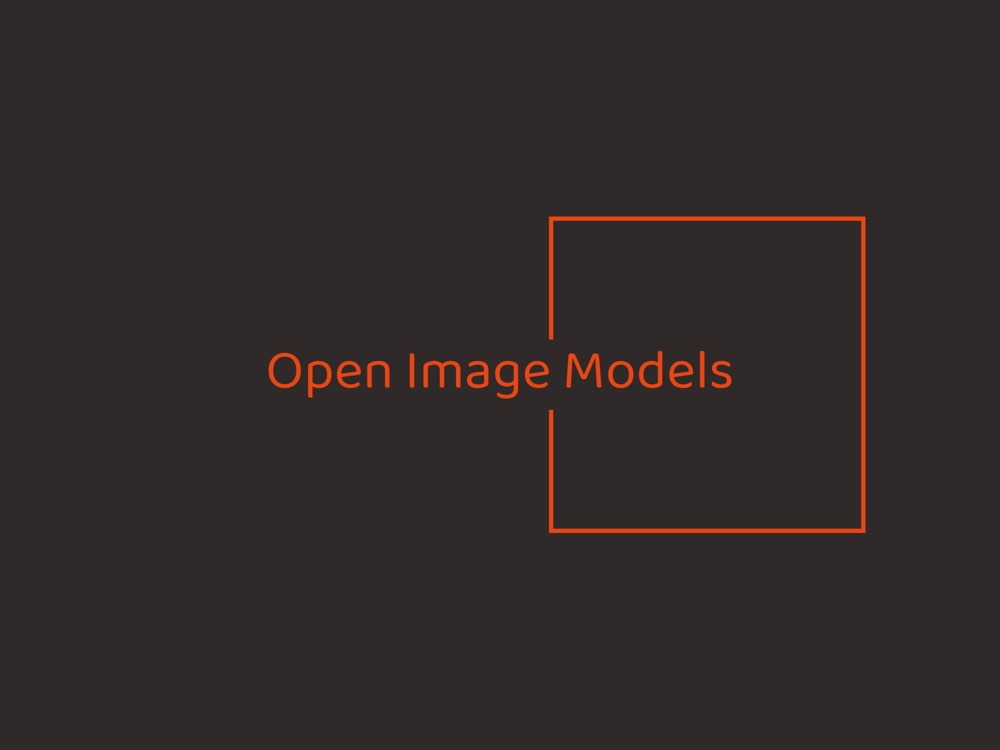

# Open Image Models

[](https://github.com/ankandrew/open-image-models/actions)
[](https://pypi.python.org/pypi/open-image-models)
[](https://pypi.python.org/pypi/open-image-models)
[](https://github.com/astral-sh/ruff)
[](https://github.com/pylint-dev/pylint)
[](http://mypy-lang.org/)
[](https://pypi.python.org/pypi/open-image-models)

<p>
  
</p>

<!-- TOC -->
* [Open Image Models](#open-image-models)
  * [Introduction](#introduction)
  * [Features](#features)
  * [Available Models](#available-models)
    * [Object Detection](#object-detection)
      * [Plate Detection](#plate-detection)
    * [Installation](#installation)
    * [Contributing](#contributing)
<!-- TOC -->

---

## Introduction

We offer **ready-to-use** models for a range of **computer vision** tasks like **detection**, **classification**, and
**more**. With **ONNX** support, you get **fast** and **accurate** results right out of the box.

Easily integrate these models into your apps for **real-time** processing—ideal for edge devices, cloud setups, or
production environments. In **one line of code**, you can have **powerful** model **inference** running!

## Features

- 🚀 Pre-trained Models: Models are **ready** for immediate use, no additional training required.
- 🌟 ONNX Format: Cross-platform support for **fast inference** on both CPU and GPU environments.
- ⚡ High Performance: Optimized for both speed and accuracy, ensuring efficient **real-time** applications.
- 📏 Variety of Image Sizes: Models **available** with different input sizes, allowing flexibility based on the task's
  performance and speed requirements.
- 💻 Simple API: Achieve license plate detection with just **one line of code**, enabling rapid integration and
deployment.

## Available Models

### Object Detection

#### Plate Detection

| Model    | Image Size | Precision (P) | Recall (R) | mAP50 | mAP50-95 | Speed (ms) |
|----------|------------|---------------|------------|-------|----------|------------|
| yolov9-t | 640        | 0.955         | 0.91       | 0.959 | 0.75     | XXX        |
| yolov9-t | 512        | 0.948         | 0.901      | 0.95  | 0.718    | XXX        |
| yolov9-t | 384        | 0.943         | 0.863      | 0.921 | 0.688    | XXX        |
| yolov9-t | 256        | 0.937         | 0.797      | 0.858 | 0.606    | XXX        |

_<sup>[1]</sup> Inference on Mac M1 chip using CPUExecutionProvider. Utilizing CoreMLExecutionProvider accelerates speed
by 5x._

<details>
  <summary>Usage</summary>

  ```python
import cv2
from rich import print

from open_image_models import LicensePlateDetector

# Initialize the License Plate Detector with the pre-trained YOLOv9 model
lp_detector = LicensePlateDetector(detection_model="yolo-v9-t-384-license-plate-end2end")

# Load an image
image_path = "path/to/license_plate_image.jpg"
image = cv2.imread(image_path)

# Perform license plate detection
detections = lp_detector.predict(image)
print(detections)

# Benchmark the model performance
lp_detector.show_benchmark(num_runs=1000)

# Display predictions on the image
annotated_image = lp_detector.display_predictions(image)

# Show the annotated image
cv2.imshow("Annotated Image", annotated_image)
cv2.waitKey(0)
cv2.destroyAllWindows()
  ```

</details>

### Installation

To install open-image-models via pip, use the following command:

```shell
pip install open-image-models
```

### Contributing

Contributions to the repo are greatly appreciated. Whether it's bug fixes, feature enhancements, or new models,
your contributions are warmly welcomed.

To start contributing or to begin development, you can follow these steps:

1. Clone repo
    ```shell
    git clone https://github.com/ankandrew/open-image-models.git
    ```
2. Install all dependencies using [Poetry](https://python-poetry.org/docs/#installation):
    ```shell
    poetry install --all-extras
    ```
3. To ensure your changes pass linting and tests before submitting a PR:
    ```shell
    make checks
    ```
